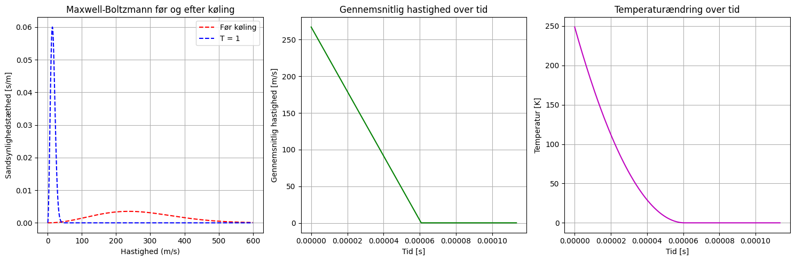

# Indhold til min SRP

## Hvad jeg mangler i min nuværende simulering:

- Detuning af laseren
- Sandsynligheden for, at en foton bliver indfaget
- Graf over hvornår/hvornår de forskællige partikler med forskællige hastigheder bliver bræmset

## Teori til SRP:

- Absorption og emmission af fotoner
  - Hvad sker der når atomer emitterer fotoner
- Bevægelsesmængde af fotoner (og bevarelsen af bevægelsesmængde)
  - $p_{foton} = \dfrac{h}{lambda}$
  - $\Delta p = p_{foton}$
- Doppler limit (bevægelsesmængden af fotonen er begrænsningen)
- Sammenhæng mellem temperatur og hastighed
  - $E_{kin} = \dfrac{3}{2} \cdot k_B \cdot T$
- Dopplereffekten
- Zeeman effekten

## Ting til min diskussion:

- Hvorfor dopplerkøling?
- Fordele og ulemper ved simuleringer

## Hvad har jeg ind til videre:

- Her er min nuværende simulering, der kan tilgås via [dette link](Laserkøling.ipynb)
  
- Jeg har nogenlunde styr på alt teorien, beskrevet i dette dokument (på nær zeeman køling)
- En kildeliste der kan tilgås via [dette link](Kildeliste.md)

## Ting jeg gerne vil finde ud af:
- Når temperaturen er for lav, virker Maxwell-Boltzmann fordelingen ikke, hvorfor det? Er der nogen andre måder at se fordelingen på?
